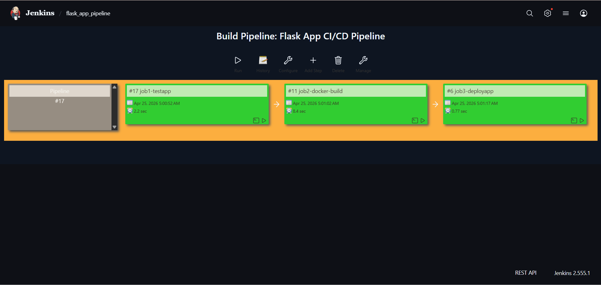

# Flask App CI/CD Pipeline with Jenkins


> A hands-on Jenkins CI/CD pipeline project built as part of the **GeeksForGeeks DevOps Course**. This project demonstrates a complete 3-stage automated pipeline: testing, Docker build, and deployment of a Python Flask application.

---

## Pipeline Overview





The pipeline runs 3 jobs in sequence:

```
GitHub Push
    |
    v
[job1-testapp]        --  Run pytest on test_app.py  (2.2 sec)
    |
    v
[job2-docker-build]   --  Build Docker image         (8.4 sec)
    |
    v
[job3-deployapp]      --  Deploy the container       (0.77 sec)
```

---

## Project Structure

```
jenkins_cicd/
├── app.py                    # Flask application
├── test_app.py               # Unit tests
├── requirements.txt          # Python dependencies
├── Dockerfile                # Docker image definition
├── Jenkinsfile               # Pipeline-as-code definition
├── sonar-project.properties  # SonarQube config
└── .github/workflows/        # GitHub Actions
```

---

## Tech Stack

- **Jenkins 2.555.1** — CI/CD automation server
- **Python / Flask** — Web application
- **Docker** — Containerization
- **Pytest** — Unit testing
- **Build Pipeline Plugin** — Visualize chained jobs

---

## Getting Started

### Prerequisites

- Jenkins installed and running
- Docker installed on the Jenkins agent
- Python 3.x
- Jenkins Plugins: Build Pipeline, Git

### 1. Clone the Repository

```bash
git clone https://github.com/Sumitkalamkar/jenkins_cicd.git
cd jenkins_cicd
```

### 2. Install Python Dependencies

```bash
pip install -r requirements.txt
```

### 3. Run Tests Locally

```bash
pytest test_app.py
```

### 4. Build Docker Image Locally

```bash
docker build -t flask-cicd-app .
docker run -p 5000:5000 flask-cicd-app
```

### 5. Set Up Jenkins Jobs

Create 3 Freestyle Jobs in Jenkins:

**job1-testapp**
- Source: Git -> this repo
- Build Step: `pip install -r requirements.txt && pytest test_app.py`
- Post-build: Trigger `job2-docker-build` if stable

**job2-docker-build**
- Build Step: `docker build -t flask-cicd-app .`
- Post-build: Trigger `job3-deployapp` if stable

**job3-deployapp**
- Build Step: `docker run -d -p 5000:5000 flask-cicd-app`

### 6. Create the Build Pipeline View

1. Click **+ New View** and choose **Build Pipeline View**
2. Set `job1-testapp` as the initial job
3. Watch your 3-stage pipeline run

---

## Build Results

| Job | Last Build | Duration |
|-----|-----------|----------|
| job1-testapp | #17 | 2.2 sec |
| job2-docker-build | #11 | 8.4 sec |
| job3-deployapp | #6 | 0.77 sec |

---

## What I Learned

This project was built while learning DevOps on the GeeksForGeeks DevOps Course. Key concepts practiced:

- Setting up Jenkins freestyle jobs
- Chaining jobs using post-build triggers
- Dockerizing a Python Flask app
- Integrating automated testing into a pipeline
- Using the Build Pipeline Plugin for visual CI/CD flows
- Writing a Jenkinsfile for pipeline-as-code

---

## Author

**Sumit Pandurang Kalamkar** — [GitHub](https://github.com/Sumitkalamkar)

